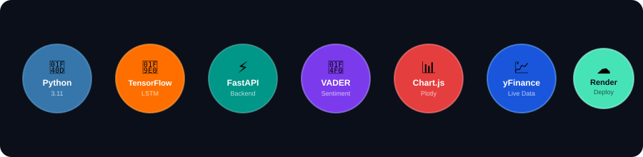

<div align="center">

# 📈 AI Stock Predictor
### *Indian Market LSTM Forecasting + AI News Sentiment*

<br/>

<!-- Animated Floating Tech Icons -->


<br/>

<p align="center">
  <strong>Next-Generation AI-Powered Indian Stock Market Prediction & News Sentiment Analysis</strong>
</p>

<br/>

<!-- Badges -->
<p align="center">
  
  
  
  
</p>

<p align="center">
  
  
  
  
</p>

<br/>

<!-- Live Demo Button -->
<a href="https://indian-stock-predictor-u36d.onrender.com">
  
</a>

</div>

---

## ✨ Features

<table>
<tr>
<td width="50%">

### 🧠 AI / ML Engine
- **LSTM Neural Network** trained on historical price data
- **Auto-save & load** trained models to skip retraining
- **Next-day price prediction** with % change indicator
- **RMSE evaluation** on test data

</td>
<td width="50%">

### 📰 Sentiment Analysis
- **Real-time news fetching** via Yahoo Finance
- **VADER NLP** scoring for each headline
- **Bullish 🐂 / Bearish 🐻 / Neutral 😐** overall signal
- **Per-article scoring** with publisher info

</td>
</tr>
<tr>
<td width="50%">

### 📊 Visualization
- **Interactive price charts** (Chart.js + Plotly)
- **Historical price trends** (last 100 days)
- **Predicted vs Actual** chart overlay
- **50-day & 200-day** Moving Averages

</td>
<td width="50%">

### 🌐 Modern Architecture
- **FastAPI backend** with REST API endpoints
- **Premium dark-mode frontend** (HTML/CSS/JS)
- **Deployed on Render** — always live
- **Vercel-compatible frontend** for separate deploy

</td>
</tr>
</table>

---

## 🏗️ Tech Stack

<div align="center">

| Layer | Technology |
|:---:|:---|
| 🤖 **ML Model** | TensorFlow / Keras — LSTM Neural Network |
| 📡 **Backend API** | FastAPI + Uvicorn |
| 🎨 **Frontend** | Vanilla HTML, CSS (Glassmorphism), JavaScript |
| 📈 **Data Source** | Yahoo Finance (`yfinance`) |
| 💬 **NLP** | VADER Sentiment Analyzer |
| 📊 **Charts** | Chart.js + Plotly |
| ☁️ **Deployment** | Render (Backend) · Vercel (Frontend) |

</div>

---

## 🚀 Getting Started

### 1. Clone the Repository
```bash
git clone https://github.com/Utkarsh4410/indian-stock-predictor.git
cd indian-stock-predictor
```

### 2. Install Dependencies
```bash
pip install -r requirements.txt
```

### 3. Run the Backend API
```bash
uvicorn api:app --reload
```
> The API starts at `http://127.0.0.1:8000`

### 4. Open the Frontend
Open `frontend/index.html` in your browser — or just navigate to `http://127.0.0.1:8000`

---

## 📱 How to Use

```
1. Enter a stock ticker (e.g. RELIANCE.NS / TCS.NS / INFY.NS)
2. Click "Analyze Stock"
3. Wait ~30-60 seconds for AI training (first run only)
4. View price predictions, charts & sentiment analysis!
```

> 💡 **Ticker Format**: Use `.NS` for NSE stocks and `.BO` for BSE stocks
> 
> Examples: `RELIANCE.NS` · `TCS.NS` · `INFY.NS` · `HDFCBANK.NS` · `WIPRO.NS`

---

## 🗂️ Project Structure

```
indian-stock-predictor/
│
├── 📄 api.py               → FastAPI backend (REST endpoints)
├── 📄 app.py               → Streamlit UI (legacy)
├── 📄 model.py             → LSTM Neural Network architecture
├── 📄 data_loader.py       → Data fetching & preprocessing
├── 📄 sentiment_analyzer.py→ News sentiment (VADER NLP)
│
├── 📁 frontend/
│   ├── index.html          → Main UI page
│   ├── styles.css          → Dark mode glassmorphism design
│   └── script.js           → API calls & Chart rendering
│
├── 📁 models/              → Saved trained models (auto-generated)
├── 📄 requirements.txt     → Python dependencies
└── 📄 .python-version      → Python 3.11.9 (for Render)
```

---

## 🌐 Live Deployment

| Service | URL |
|:---:|:---|
| 🟢 **Live App (Backend + Frontend)** | [indian-stock-predictor-u36d.onrender.com](https://indian-stock-predictor-u36d.onrender.com) |
| 📦 **GitHub Repository** | [github.com/Utkarsh4410/indian-stock-predictor](https://github.com/Utkarsh4410/indian-stock-predictor) |

> ⚠️ The free Render tier may have a **cold start delay of ~30 seconds** after inactivity.

---

<div align="center">

Made with ❤️ by **Subodh / Utkarsh**


</div>
